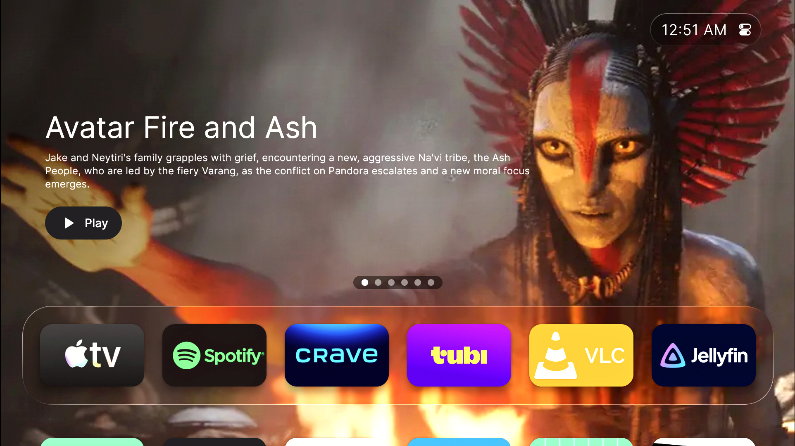

# Liquid Launcher TV

A fast, minimal liquid-glass launcher for Android TV and Google TV. Zero clutter, smooth navigation, deep customization — all from your remote.

**[fireflies-studios.ca/liquid-launcher-tv](https://fireflies-studios.ca/liquid-launcher-tv/)**

---

## Download

**[Get it on Google Play](#)** — *link at launch*

Requires **Android 9 (API 28)** or newer. Built for Android TV, Google TV, Chromecast with Google TV, and Google TV Streamer.

---

## Features

### Home screen
- **Top bar** — clock and date (12h/24h) with a Control Center for Wi-Fi, Display & Sound, Google TV Home, Screensaver, Preferences, and System Settings
- **Continue Watching** — full-screen carousel of what to watch next from your streaming apps, toggleable and filterable per app
- **Dock** — your top apps, fully reorderable, over a liquid-glass background
- **App grid** — everything else, with the dock sliding up as you scroll down

### Make it yours
- Icon pack support, plus per-app custom icons
- 16 gradient themes
- Image and video wallpapers
- Screensaver with clock, date, weather, and optional ambient photo mode
- App Manager — hide apps without uninstalling, reorder anything

### Controls
- Hold **OK** on any app card for move / hide / change icon / app info
- Optional Back button override
- Optional Home button override — the default-launcher role, or the accessibility service on TVs where the built-in launcher takes priority for the HOME key
- Start on boot

### Languages
Available in over 80 languages, following whatever your TV is set to. Right-to-left
layouts (Arabic, Hebrew, Persian, Urdu) are supported.

HDMI and AV inputs appear as regular cards and can be moved or hidden like any app.

---

## Premium

Most of the launcher is free. A one-time **$6.99** purchase unlocks:

| Feature | What it does |
|---|---|
| **Icon Pack** | re-icon app cards from any installed pack |
| **Custom App Icons** | set a different icon for any individual app |
| **Ambient Mode** | photo wallpapers in the screensaver |
| **Pick Wallpaper** | use your own image as the background |
| **Pick Video Wallpaper** | play a looping video behind the launcher |

No subscription. No ads. No tracking.

---

## Reporting a bug

[**Open an issue**](../../issues/new/choose) using the **Bug report** template.

TV hardware varies enormously and most bugs turn out to be device-specific, so including your **device model and Android version** makes a fix dramatically more likely. Please check [existing issues](../../issues) first.

## Requesting a feature

Use the **Feature request** template. Requests are read, and popular ones tend to get built — no promises on timing.

## Support

For anything not suited to a public issue — purchase problems, account questions — email **firefliesstudios.ca@gmail.com**.

Purchases and refunds are handled by Google Play, not here: [Google Play refunds](https://support.google.com/googleplay/answer/2479637).

---

## Releases

Release notes are published under [**Releases**](../../releases).

The app is distributed **exclusively through Google Play**. No APKs are published here — builds obtained anywhere else are not ours and are not supported.

---

## Privacy

See [PRIVACY.md](PRIVACY.md).

Short version: no accounts, no analytics, no ads, no tracking, and nothing about you is stored on any server. Two optional features make network requests — screensaver weather, which only ever knows the city you type in yourself, and Ambient Mode photos. Neither reports anything about you, and with both off the app never goes online.

---

## Credits

Built with Kotlin, Jetpack Compose, and Material 3 for TV.

- [Backdrop](https://github.com/Kyant0/Backdrop) by Kyant0 — the liquid-glass effect — Apache 2.0
- [Coil](https://coil-kt.github.io/coil/) — image loading — Apache 2.0
- [Open-Meteo](https://open-meteo.com/) — weather data — CC BY 4.0
- [Unsplash](https://unsplash.com/) — screensaver photography

Full attributions are in the app under **Settings → About → Licenses & Credits**.

App icons and trademarks are the property of their respective owners. Liquid Launcher TV is not affiliated with or endorsed by any third-party brand.
